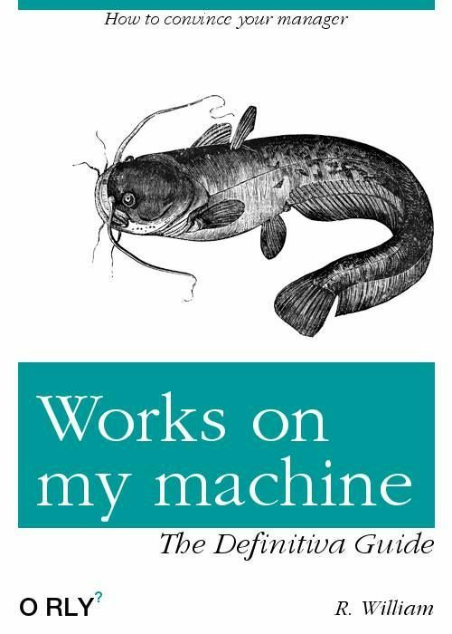
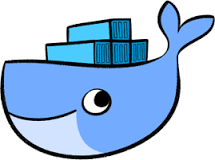
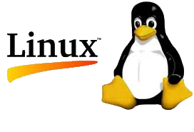
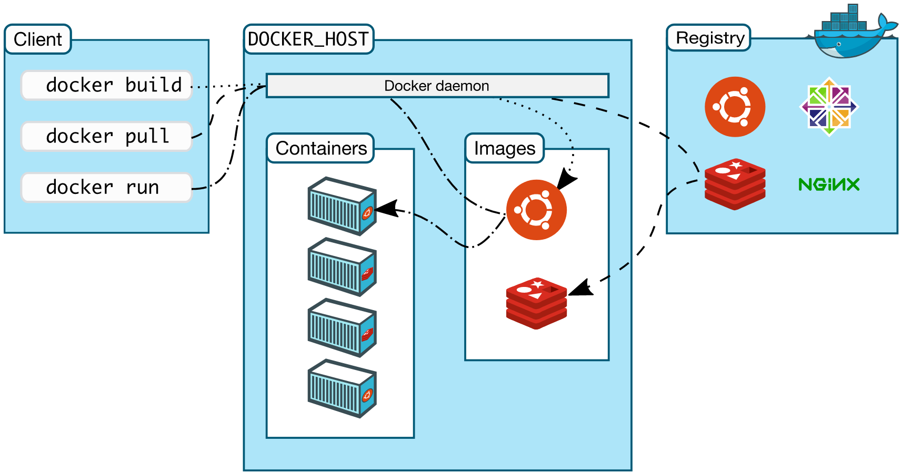
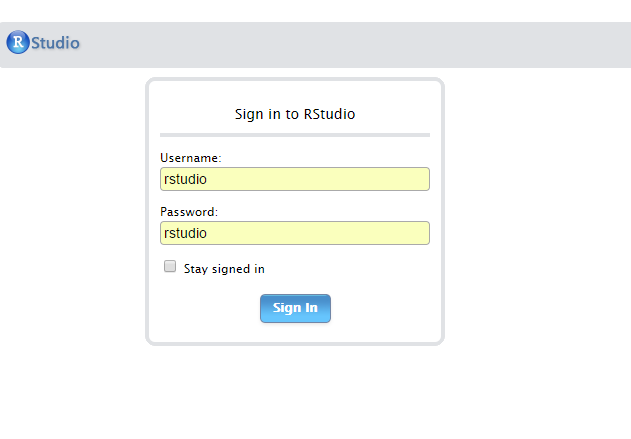
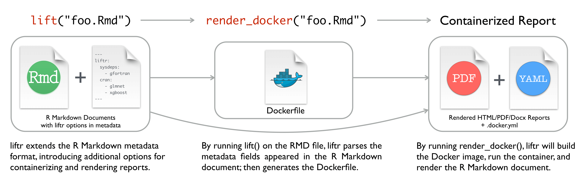
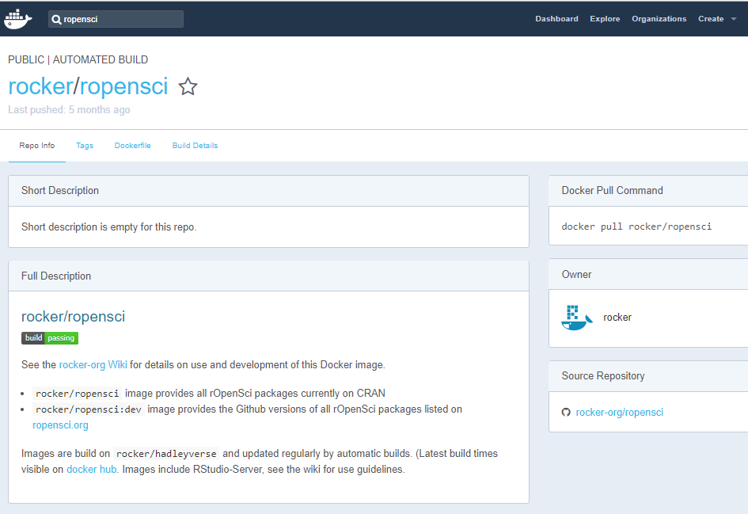

```{r setup, include=FALSE}
knitr::opts_chunk$set(echo = FALSE)
```

## Situaciones cotidianas

- **"Inicio un nuevo proyecto."**


## Situaciones cotidianas

- "Inicio un nuevo proyecto."
- **"No recuerdo cómo instalé aquella librería que necesito para este paquete."**

## Situaciones cotidianas

- "Inicio un nuevo proyecto."
- "No recuerdo cómo instalé aquella librería que necesito para este paquete."
- **"En windows."**

## Situaciones cotidianas

- "Inicio un nuevo proyecto."
- "No recuerdo cómo instalé aquella librería que necesito para este paquete."
- "En windows."
- **"Vamos a pasarlo todo a producción."**

## Situaciones cotidianas

- "Inicio un nuevo proyecto."
- "No recuerdo cómo instalé aquella librería que necesito para este paquete."
- "En windows."
- "Vamos a pasarlo todo a producción."
- **"Equipo nuevo. A instalar/configurar todo."**

## Situaciones cotidianas

- "Inicio un nuevo proyecto."
- "No recuerdo cómo instalé aquella librería que necesito para este paquete."
- "En windows."
- "Vamos a pasarlo todo a producción."
- "Equipo nuevo. A instalar/configurar todo."
- **"Entornos compartidos. Equipos de trabajo."**

## Situaciones cotidianas

- "Inicio un nuevo proyecto."
- "No recuerdo cómo instalé aquella librería que necesito para este paquete."
- "Es que en windows es muy complicado (o no funciona)."
- "¿Pasarlo a producción?. Claro. Muy fácil...(caveats)"
- "Equipo nuevo. A instalar/configurar todo."
- "Entornos compartidos. Equipos de trabajo."
- **"Desarrollo en otra plataforma. Burocracia."**

- **....y la excusa favorita......**

#  
<center></center>

## Soluciones habituales

- **Usamos máquinas virtuales**

De gran tamaño, es muy complicado mover de un sitio a otro y además tienen 
requerimientos de computación exagerados. Es necesaria mucha memoria y CPU.

## Soluciones habituales

- Usamos máquinas virtuales

- **Guardamos Imágenes del disco**

Mismo problema que las máquinas virtuales pero magnificado. Las plantillas se
quedan obsoletas y hay que actualizarlas cada cierto tiempo.

## Soluciones habituales

- Usamos máquinas virtuales

- Guardamos Imágenes del disco

- **Lo documentamos *TODO*.** 

<div align="center"></center>

## Soluciones de R

Algunos paquetes o el mismo Rstudio intentan paliar el problema o alguna de sus partes:

- **Packrat**

- **checkpoint**

- **minicran**

- **mran Time machine**

- **switchr**

Seguimos sin solucionar el problema. Son soluciones a posteriori.

## ¿cómo llego a Docker?

Trabajo de varios años en equipos multidisciplinares de sistemas, principalmente en start-ups, con énfasis en:

- reproducibilidad
- despliegue sencillo y rápido
- fácil de compartir
- fácil de enseñar
- sin costes asociados
- evitando la deuda técnica

## ¿Qué es Docker?

<center></center>

### Wikipedia:

*"Docker es un proyecto de código abierto que automatiza el despliegue de aplicaciones dentro de contenedores de software, proporcionando una capa adicional de abstracción y automatización de Virtualización a nivel de sistema operativo en Linux.*

## ¿Qué es Docker?

<center></center>

### ¿Qué es? (muy resumido):
*"Lo bueno de la máquina virtual sin lo malo de la máquina virtual"*

Aprovechando toda la potencia de linux sólo se virtualiza lo que se necesita. Del resto se
encarga el sistema anfitrión.

## Docker vs. Máquina Virtual

<center></center>

##  ¿Linux? 

### ¿Se puede usar en Windows (o Mac OS)?

Si. Se puede usar en Windows cumpliendo ciertos requisitos.

- Microsoft Hyper-V 64bit Windows 10 Pro, Enterprise / Education 

En Mac OS, Yosemite 10.10.3 o superior.
- procesadores 64 Bits,
- 4 GB RAM minimo.

Siempre recomendable usar Linux (no solo para Docker, sino en general)

<center></center>


## Ventajas

- **Aislamiento**

No dependen del hardware ni del sistema operativo host.

## Ventajas

- Aislamiento
- **Portabilidad**

Permiten mover de manera muy rápida y fácilmente el software de una máquina a
otra.

## Ventajas

- Aislamiento
- Portabilidad
- **Sencillez**

Su uso es relativamente sencillo. Basta conocer 5 ó 6 comandos y unas nociones
muy básicas. Luego si queremos podemos profundizar (y hay mucho jardín donde meterse).

## Ventajas

- Aislamiento
- Portabilidad
- Sencillez
- **Muy popular**

Cada vez más usado, nos permite acceder a muchísima documentación o ayuda de 
manera sencilla. En parte se maneja como un repositorio distribuido tipo GIT.
Además hay imágenes para casi todo lo que nos imaginemos.

## Conceptos básicos

- **Contenedor**

Es la parte activa con la que interactuamos. "Hace cosas".

## Conceptos básicos

- Contenedor
- **Imagen**

La plantilla en la que se basa el contenedor para saber lo que tiene que hacer.

## Conceptos básicos

- Contenedor
- Imagen
- **Registro**

Repositorio en el cual de manera abierta se ponen a disposición las imágenes.
Uno de los más conocidos y usados es "Docker Hub". 

https://hub.docker.com/
            

## Conceptos básicos

- Contenedor
- Imagen
- Registro
- **Dockerfile**

Es la *"receta"* para construir una imagen desde cero. 


## Arquitectura

<center></center>

## ¿Funciona para R?

Entre otras muchas cosas.

Existen imagenes para *casi* todo.
"Todas?" las distribuciones Linux (Ubuntu, CentOS, Debian), entornos de base de datos, tanto **No Sql** (Redis, MongoDB, Cassandra) como **Si Sql** (Mysql, postgreSQL), entornos de programación, servicios de todo tipo....

Recomendación: usar imágenes *"oficiales"*

https://hub.docker.com/explore/


## ¡Let's Rocker! 


Carl Boettiger (knitcitations, EML, RNeXML....) 


Dirk Eddelbuettel (Rcpp, RcppArmadillo, RcppEigen, digest...)

mantienen **Rocker**, un repositorio muy completo con diferentes versiones de R.


http://www.carlboettiger.info/

http://dirk.eddelbuettel.com/


## Rocker sites

En github:

https://github.com/rocker-org/rocker

En Docker Hub:

https://hub.docker.com/u/rocker/

## Comandos básicos

Buscar/Obtener una imagen

```
docker search ropensci --no-trunc
docker pull rocker/ropensci

```
Generar un contenedor a partir de la imagen

```
docker run --rm -p 8787:8787 --name="test" -v ~/dockerdata/:/data rocker/rstudio

docker run -d -p 8787:8787 rocker/rstudio:3.2.0

```

Conectar con Rocker

```
localhost:8787 

```

## Login

<center></center>


## ¿Dónde están los datos?

### Otro concepto básico: **Volúmenes**
Los volúmenes son puntos de montaje que asociamos a un contenedor. Mapeados
contra un directorio de nuestro sistema anfitrión nos permite tener acceso
a su contenido.

- En windows
```
docker run --rm -it p 8787:8787 -v \
C://Users/miusuario/Documents/Docker:/srv/shiny-server 6dc473697f85
```
- En Linux
```
docker run --rm -it p 8787:8787 -v /home/data:/data 6dc473697f85
```

## Más comandos útiles

- docker images

```
REPOSITORY           TAG         IMAGE ID            CREATED             SIZE
rocker/shiny         latest      682eb5fda1f3        12 days ago         1.23 GB
trescuatrodos        latest      fbac184a48f6        2 weeks ago         4.52 GB
trescuatro           latest      7781ee1f031f        2 weeks ago         4.5 GB
jvera/tidyviz        latest      3930c226a472        2 weeks ago         4.54 GB
rocker/ropensci      latest      8bf0948db340        2 weeks ago         3.46 GB
rocker/tidyverse     latest      83f91871d62f        3 weeks ago         1.56 GB
ubuntu               latest      f7b3f317ec73        4 weeks ago         117 MB
rocker/rstudio       latest      a3f43bf49425        2 months ago        990 MB
hello-world          latest      48b5124b2768        4 months ago        1.84 kB
d4w/nsenter          latest      9e4f13a0901e        8 months ago        83.8 kB
```

## Más comandos útiles

- docker ps [-a]
- docker images         (lista las imagenes)
- docker build          (construye un contenedor con un Dockerfile)
- docker rmi nombre/id  (borra la imagen)
- docker stop           (para el contenedor)
- docker rm nombre/id   (borra el contenedor)
- docker system prune   (limpia el sistema)
- docker commit         (guarda los cambios del contenedor)

**¡Cuidado!**

Si no se guardan los cambios el contenedor vuelve al estado inicial. Pero...

## es mejor usar el Dockerfile

```
----------------------
FROM rocker/rstudio:latest

RUN apt-get update -qq && apt-get -y --no-install-recommends install \
  libxml2-dev \
  libcairo2-dev \
  libpq-dev \
  libudunits2-dev \
  && . /etc/environment \
  && install2.r --error \
	devtools tidyverse ggplot2 profvis formatR \
	remotes rio validate MASS magrittr 
	
RUN Rscript -e 'devtools::install_github("smach/rmiscutils")' 
RUN rm -rf /tmp/downloaded_packages/
---------------------
```
docker build .

## Con todo ya empezado

http://o2r.info/2017/05/30/containerit-package/

Podemos generar un Dockerfile con nuestras sesiones de trabajo.

```
devtools::install_github("r-hub/sysreqs")

devtools::install_github("o2r-project/containerit")

library(containerit)

dockerfile_object <- dockerfile()

print(dockerfile_object)
```

## Con todo ya empezado

```
FROM rocker/r-ver:3.4.0
LABEL maintainer="jvera"
RUN export DEBIAN_FRONTEND=noninteractive; apt-get -y update \
 && apt-get install -y libcurl4-openssl-dev \
 	libpq-dev \
 	libssl-dev \
 	make \
 	pandoc \
 	pandoc-citeproc \
 	zlib1g-dev
 RUN ["install2.r", "-r 'https://cloud.r-project.org'", "anytime", "Hmisc", "ggplot2", "Formula", "survival", "lattice",  "RPostgreSQL", "DBI", "plyr", "tidyr", "pathological", "magrittr", "rio", "dplyr", "tibble", "pacman", "Rcpp", "assertive.properties", "assertive.types", "assertthat", "digest", "R6", "cellranger", "futile.options", "backports", "acepack", "RApiDatetime", "httr", "assertive.strings", "rlang", "lazyeval", "curl", "readxl", "data.table", "rpart", "Matrix", "checkmate", "devtools", "stringr", "foreign", "htmlwidgets", "munsell", "base64enc", "htmltools", "nnet", "gridExtra", "htmlTable", "codetools", "withr", "assertive.base", "gtable", "git2r", "scales", "stringi", "latticeExtra", "assertive.reflection", "futile.logger", "openxlsx", "lambda.r", "RColorBrewer", "assertive.numbers", "colorspace", "cluster", "assertive.files", "memoise", "knitr", "haven", "remotes"]
 RUN ["installGithub.r", "krlmlr/here@efd50cb", "krlmlr/rprojroot@6d1069c"]
 WORKDIR /payload/
 CMD ["R"]
```

## Recomendaciones para el Dockerfile

- **Limitar el numero de capas**.


## Recomendaciones para el Dockerfile

- Limitar el numero de capas.
- **1 Contenedor, 1 función**.

## Recomendaciones para el Dockerfile

- Limitar el numero de capas.
- 1 Contenedor, 1 función.
- **No incluir datos. Los datos "viven" fuera de los contenedores**.

## Recomendaciones para el Dockerfile

- Limitar el numero de capas.
- 1 Contenedor, 1 función.
- No incluir datos. Los datos "viven" fuera de los contenedores.
- **Aunque hay contenedores de datos**.

## Consejos generales

- **Atentos al disco duro sobre todo al principio**.


## Consejos generales

- Atentos al disco duro sobre todo al principio.
- **Comparte las imagenes. Tu trabajo puede ser útil para alguien.**


## Consejos generales

- Atentos al disco duro sobre todo al principio.
- Comparte las imagenes. Tu trabajo puede ser útil para alguien.
- **No reinventar la rueda, aprovecharse de los miles de imágenes que hay.**


## Consejos generales

- Atentos al disco duro sobre todo al principio.
- Comparte las imagenes. Tu trabajo puede ser útil para alguien.
- No reinventar la rueda, aprovecharse de los miles de imágenes que hay.
- **Estad atentos. El proyecto evoluciona muy/demasiado rápido.**


## Por ejemplo:

**liftr**: paquete R que permite levantar un contenedor con el entorno definido para un reporting automatizado (2017-09-29)

https://liftr.me/




## Consejos generales

- Atentos al disco duro sobre todo al principio.
- Comparte las imagenes. Tu trabajo puede ser útil para alguien.
- No reinventar la rueda, hay miles de imágenes.
- Estad atentos. El proyecto evoluciona muy/demasiado rápido.
- **NUNCA para sistemas críticos en producción.**

<div align="center"></div>


## Cosas (un poco) avanzadas

- *Machine*:  Despliegue rápido de motores de Docker en cloud/local.

- *Swarm*:    clusters de contenedores. Varios motores docker como uno solo.

- *Compose*:  aplicaciones multicontenedor.

- *Kubernetes*: Orquestación

- *CoreOS*: Sistema operativo dedicado para aplicaciones basadas en contenedores


## Algunas imágenes interesantes

r/datascienceworkshops/data-science-at-the-command-line/

kaggle/rstats

kaggle/julia

kaggle/python

r/rocker/ropensci/

Jupyter:  https://www.dataquest.io/blog/docker-data-science/


#  
<center></center>


#  
<center></center>

# rOpenSpain

hola@ropenspain.es


## Enlaces

https://github.com/veggiemonk/awesome-docker

https://github.com/wch/harbor

http://o2r.info/2016/12/15/investigating-docker-and-R/

https://cran.r-project.org/web/packages/liftr/vignettes/liftr-intro.html

http://seankross.com/2017/09/17/Enough-Docker-to-be-Dangerous.html

https://github.com/PRL-PRG/docker-r-full-base

https://travis-ci.org/

https://thehftguy.com/2016/11/01/docker-in-production-an-history-of-failure/

## Notas finales

  - **Rapidez y utilidad**. 

Muy útil para el desarrollo. Ahorra mucho tiempo en configuraciones. Con una pequeña inversión inicial de tiempo los beneficios son tangibles.

  - **Compartir**. 

Desplegar desde cualquier lugar con los registros y los Dockerfiles. Repositorio común de configuraciones para diferentes funcionalidades.

  - **Multiplataforma**. 

Desarrollo desde cualquier plataforma origen para cualquier plataforma destino. 

  - Aplicaciones críticas en producción. (de momento no)

## Gracias!


<center></center>


## Gracias!


<center></center>


Twitter: @verajosemanuel

DockerHub: https://hub.docker.com/u/jvera/

Blogdown: http://jvera.rbind.io
